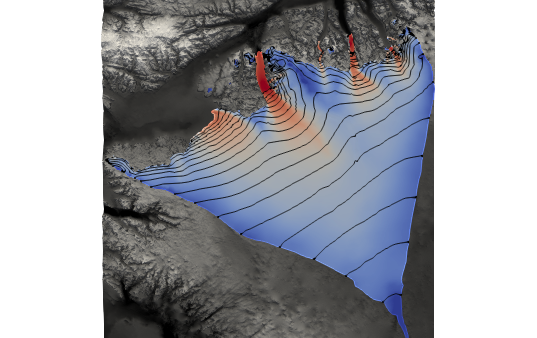

# North Greenland model

This repository contains the material to model ice flow of the 1.1 and 1.2 [IMBIE drainage bassins](http://imbie.org/imbie-2016/drainage-basins) in north Greenland.

This material has been prepared by F. Gillet-Chaulet (IGE, Grenoble, France) for the Nov. 2020 [Elmer/Ice beginner course](http://elmerfem.org/elmerice/wiki/doku.php?id=courses:2020:online2020).

This example illustrates the capabilities of Elmer/Ice to model ice sheets using the Shallow Shelf Approximation (SSA) and inverse methods.

This example is based on the configuration files for the Greenland Ice Sheet described [here](http://elmerfem.org/elmerice/wiki/doku.php?id=eis:greenland).

 

# Content

- **Data/**: data sets required to run the example

- **Codes/**: codes for pre- and post- processing

- **Elmer/**: Elmer configuration files

- **Slides/**: slides presented for the course.

- **ElmerVM/**: Installation instructions to upgrade the Virtual Machine 
