--- 
title: "Elmer Ice Sheet"
subtitle: 'Lower order models and inverse problems'
author: "Fabien Gillet-Chaulet" 
date: "26 & 27 November 2020" 
output: 
  ioslides_presentation: 
    css: styles.css 
    logo: './logos/logo_elmerICE.png' 
    widescreen: true 
    smaller: true 
---

```{r setup, include=FALSE} 
library(ggplot2)
knitr::opts_chunk$set(echo = FALSE) 
```

## Course objectives

We will model the 1.1 and 1.2 [IMBIE drainage
bassins](http://imbie.org/imbie-2016/drainage-basins) in north Greenland with
[Elmer/Ice](https://elmerice.elmerfem.org/).


<div class="centered"> 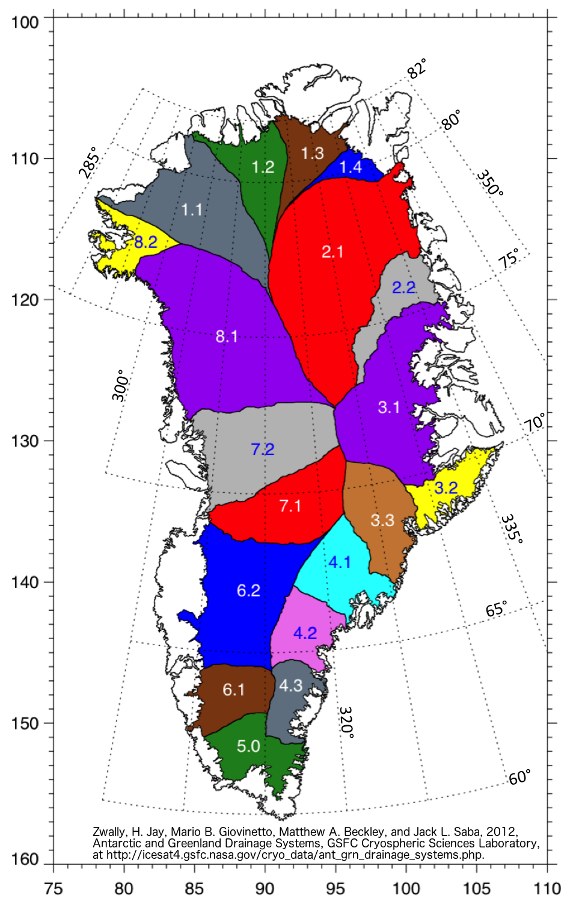
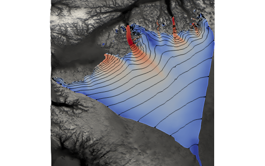 </div>

## Course objectives

**We will see how to:**

- mesh a complex domain

- interpolate netcdf data sets on the mesh

- use the 2D mesh adaptation

- use shallow approximations to model large domains

- use the inverse methods to initialise poorly known fields

<br /> 

This example is based on the configuration files for the Greenland Ice
Sheet described
[here](http://elmerfem.org/elmerice/wiki/doku.php?id=eis:greenland).


# foreword

## Course Material | Sources


- The material for this course is available under a github
repository:

  - https://github.com/ElmerCSC/ElmerIceCourses

  - You can:

    - clone this repository:
     ```bash 
     git clone https://github.com/ElmerCSC/ElmerIceCourses.git
     ```

    - download a .zip file [here](https://github.com/ElmerCSC/ElmerIceCourses/archive/main.zip)

<br />

**These slides present the north-greenland test case**

## Course Material | Content

- **Data/**: data sets required to run the example
- **Codes/**: codes for pre- and post- processing
- **Elmer/**: Elmer configuration files
- **Slides/**: slides presented for the course.
- **ElmerVM/**: Installation instructions to upgrade the Virtual Machine

## WARNING

- Several steps require that Elmer has been compiled with some external
libraries (netcdf, mmg, interpolation) and will not run with a default
installation.
- See the **README.md** files in the **Elmer/** directories for more details on
requirements to solve the sub-problems.
- Sub-problems **4a** and **4b** (DIAGNOSTIC and PROGNOSTIC simulations) will
run with a default installation.


# Initial steps

## Define your model domain

- I will <span style="color:red">not</span> give a course on how to use a **geographic information system (GIS)**
- I use **QGIS**

<br />

- I provide the model domain as a shapefile under **Data/domain/**:
  - The model domain is made of IMBIE bassins 1.1 and 1.2 extended up to the ocean 
    - to allow a free advance of land terminating glaciers up to the ocean
    - use natural boundary conditions for ice-shelfs
    
    
  - The shapefile contains lines with the attribute **BC** to define different boundary condition
    - **BC 1** correspond to flow lines and will have a no-penetration condition
    - **BC 2** is the downstream boundary in contact with the ocean, and will have the natural calving front condition
    

---

<div class="centered">
```{r, out.width = "70%", echo=FALSE}
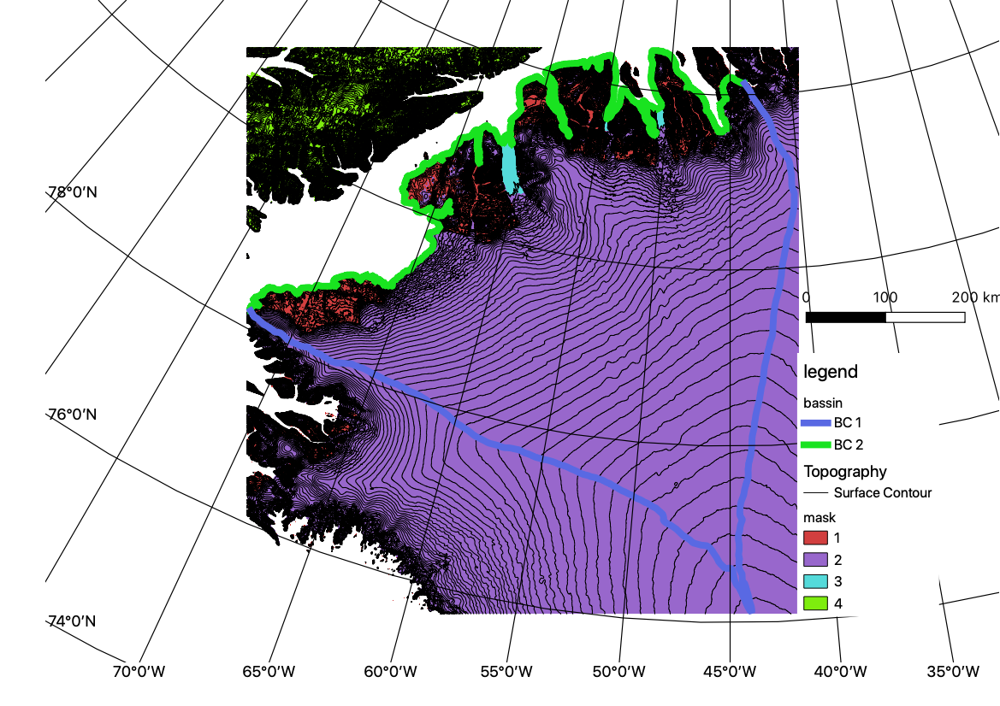
```
</div>

## Mesh your model domain

- We use python codes under **Codes/PreProcessing** to make a gmsh .geo file from the shapefile.

- Original source codes and documentation are given [here](https://github.com/ElmerCSC/elmerfem/tree/elmerice/elmerice/Meshers/GIS)

- Go to **Elmer/1_MESH_INI**:

  - Use *Contour2geo.py* to make the gmsh .geo
    ```bash
	  python ../../Codes/PreProcessing/Contour2geo.py -r 2000.0 -i ../../Data/domain/bassin.shp -o mesh.geo
    ```
    
  - Make the mesh and convert to Elmer format
  
    ```bash  
    gmsh -2 mesh.geo 
    ElmerGrid 14 2 mesh.msh -autoclean
    ```


  - For visualisation you can convert the Elmer mesh to a shapefile using *MeshToShp.py*:
    ```bash
    python ../../Codes/PreProcessing/MeshToShp.py -d mesh 
    gdalsrsinfo  -o wkt "EPSG:3413" > mesh_shp/elements.prj 
    gdalsrsinfo  -o wkt "EPSG:3413" > mesh_shp/boundaries.prj 
    ```

## Interpolating real data on your mesh nodes

Available solvers:

- [Grid2DInterpolator](http://elmerfem.org/elmerice/wiki/doku.php?id=solvers:grid2dinterpolator)
    - Read a regular 2D grid in **ASCII** 
    - Bi-linear interpolation
    - A *no-data* can be provided, values assigned to closest point
    - Used for the Tete-Rousse application

---

- [GridDataReader](http://elmerfem.org/elmerice/wiki/doku.php?id=solvers:griddatareader)
    - Read a structured **netcdf** file (2D,3D,4D)
    - Elmer has to be compiled with the netcdf libraries 
      ```bash
      cmake
        -DNetCDF_INCLUDE_DIR=PATH_TO_INCLUDE \
        -DNetCDF_LIBRARY=PATH_TO_libnetcdf.so \
        -DNetCDFF_LIBRARY=PATH_TO_libnetcdff.so 
    ```
    - Linear interpolation
    - Linear transformation can be applied
    - Valid Min & Max values can be given in the .sif file; results will get this value if any data in the current cell is out of the range
    - A default value can be given if a node is outside the dataset
    - Do not check for the *\_FillValue* attribute

---

- [Scattered2DDataInterpolator](http://elmerfem.org/elmerice/wiki/doku.php?id=solvers:scattered)
  - Interpolate sparse 2D data sets, i.e. no structure required
  - The data can be provided as an **ASCII file** (x,y,value) or a structured **2D** netcdf files with x and y coordinates
  - Rely on external librairies, :
    - [nn](https://github.com/sakov/nn-c): a C code for Natural Neighbours interpolation
    - [csa](https://github.com/sakov/csa-c) : a C code for cubic spline approximation
  - Need to compile Elmer with these libraries
    ```bash
      cmake
        -DWITH_ScatteredDataInterpolator:BOOL=TRUE \
        -DNetCDF_INCLUDE_DIR=PATH_TO_INCLUDE \
        -DNetCDF_LIBRARY=PATH_TO_libnetcdf.so \
        -DNetCDFF_LIBRARY=PATH_TO_libnetcdff.so \
        -DCSA_LIBRARY=PATH_TO_libcsa.a \
        -DCSA_INCLUDE_DIR=PATH_TO_csa \
        -DNN_INCLUDE_DIR=/PATH_TO_nn \
        -DNN_LIBRARY=PATH_TO_libnn.a
    ```
  - The *\_FillValue* attribute is used to define a no data value in a netcdf file
  
## Elmer Implementation
See example in **Elmer/1b_IMPORT_DATA**

- GridDataReader syntax:
```text
Solver *solver id* 
  Equation = Reader
    Procedure = "GridDataReader" "GridDataReader"
    Variable = -nooutput dumy

   Read full array = logical True      ! read the full netcdf at once instead of 
                                       ! inquiring values for each cell
   Filename = File "$TOPOGRAPHY_DATA$" ! name of the .nc file

   X Dim Name = File "x"               ! dimensions
   Y Dim Name = File "y"
   
   Variable 1 = File "thickness"       ! var name in .nc file
   Target Variable 1 = String "HGrid"  ! name of the Elmer variable
   Valid Min Value 1 = Real $HMin      ! valid min value

   Exported Variable 1 = HGrid         ! create the variable in Elmer
End
```

---

- Scattered2DDataInterpolator syntax:

```text
Solver 2
  Equation = Reader2
    Procedure = "Scattered2DDataInterpolator" "Scattered2DDataInterpolator"
    Variable = -nooutput dumy2

  Variable 1 = File "thickness"                    ! var name in .nc file
  Variable 1 data file = File "$TOPOGRAPHY_DATA$"  ! name of the .nc file
  Variable 1 Valid Min Value  = Real $HMin         ! valid min value
  Target Variable 1  = String "H"                  ! name of the Elmer variable

  Exported Variable 1 = H                          ! create the variable in Elmer
End
```
## Results

- Differences are small in the interior
- Scattered2DDataInterpolator slower because it do not use the existing structure
- Scattered2DDataInterpolator understand the *\_FillValue* attribute and thus better reproduce the discontinuity at the front


<div class="centered">
```{r, out.width = "60%", echo=FALSE}
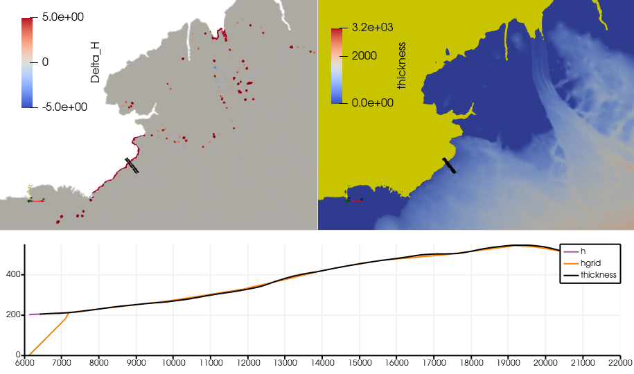
```
</div>
  
## Mesh Optimisation 

In many applications some variables changes by order of magnitudes or present discontinuites. 

In these cases it becomes desirable to increase the mesh resolution in some areas while keeping low resolution in some other to keep computing ressources.

Elmer/Ice includes a **2D anisotropic mesh adaptation scheme** and rely on the external library [mmg](https://www.mmgtools.org/) to do the remeshing. 

See the [documentation](http://elmerfem.org/elmerice/wiki/doku.php?id=mesh:meshadaptation) for the installation procedure.


---

<div class="centered">
```{r, out.width = "60%", echo=FALSE}
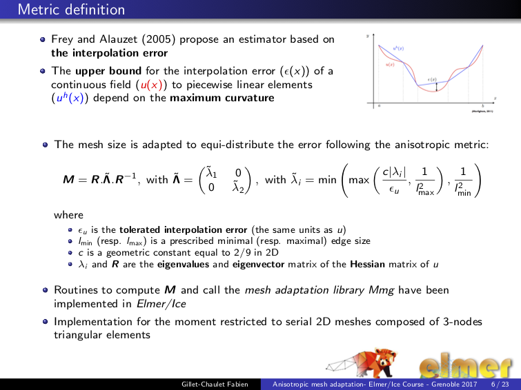
```
</div>

For additionnal informations, you can see this [presentation](http://elmerfem.org/elmerice/wiki/lib/exe/fetch.php?media=courses:2017:mesh_adapt_2017.pdf) that was presented at the [Advanced Elmer/Ice Workshop - IGE 2017](http://elmerfem.org/elmerice/wiki/doku.php?id=courses:ige2017)

## Example

- See implementation example in **Elmer/2_MESH_OPTIMISATION**
- Features:
  - mesh is optimised with respect to the observed velocity and thickness
  - the maximal mesh size is function od the distance to the front (to keep higher resolution near the margin; where most of the changes will occur in future simulations)


<div class="centered">
```{r, out.width = "50%", echo=FALSE}
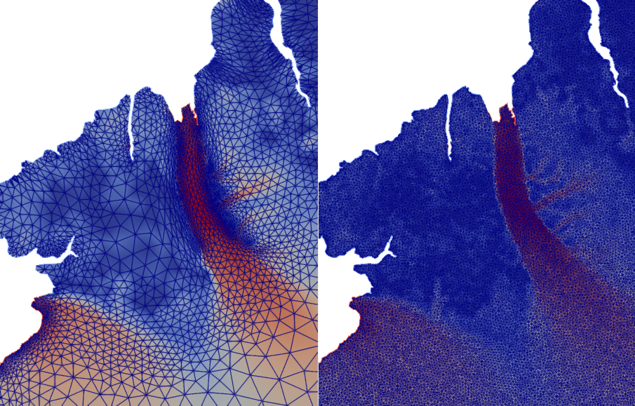
```
</div>

## Remarks

- Limited to serial 

- Can be used in a transient scheme so that the mesh refinement follow the simulation. See [here](https://github.com/ElmerCSC/elmerfem/tree/elmerice/elmerice/Tests/MMG2D_Transient)

- The optimised 2D mesh can be extruded for 3D simulations

- Joe Todd's 3D calving machinery relies on the 3D version of *mmg*


# Lower order models

## foreword

- Elmer/Ice also includes shallow approximations to the Stokes equations

- Focus has been more on ice sheet margins and ice-streams/ice shelf systems, the Shelfy-Stream Approximation has been used "operationnaly" to run simulations of the Greenland and Antarctic ice sheets

- There is a [SIA solver](http://elmerfem.org/elmerice/wiki/doku.php?id=solvers:sia) however it has been implemented mostly for comparison with the Stokes solution and thus is not **optimised** for large scale simulations

- I will not give a course on ice sheet modelling; see e.g. Greve and Blatter, "Dynamics of Ice Sheets and Glaciers" for details on the derivation of these approximations

- Here, we will see how to use the SSA solver to compute the velocity field and make transients simulations with the thickness solver


## Shallow Shelf Approximation Solver

- Solves the shelfy-Stream approximation for the horizontal velocity $\boldsymbol{u}=(u,v)$:
<font size="2">
$$\dfrac{\partial}{\partial x} \left( 2H\bar{\eta} (2\dfrac{\partial u}{\partial x}+\dfrac{\partial v}{\partial y})\right) + \dfrac{\partial}{\partial y} \left( H\bar{\eta} (\dfrac{\partial u}{\partial y}+\dfrac{\partial v}{\partial x})\right) + \tau_{b_x} = \rho_i g H  \dfrac{\partial z_s}{\partial x} $$
$$ \dfrac{\partial}{\partial x} \left( H\bar{\eta} (\dfrac{\partial u}{\partial y}+\dfrac{\partial v}{\partial x})\right) + \dfrac{\partial}{\partial y} \left( 2H\bar{\eta} (2\dfrac{\partial v}{\partial y}+\dfrac{\partial u}{\partial x})\right) + \tau_{b_y} = \rho_i g H  \dfrac{\partial z_s}{\partial y}$$
</font>

with :

- the ice thickness <font size="2">$H=z_s-z_b$</font>

- the averaged effective viscosity $\bar{\eta}$ given by 
  <font size="2">$$\bar{\eta} =  \dfrac{1}{2} 2^{1/n} E_e^{1/n-1}  \bar{\nu}$$</font>

  where :

    - <font size="2">$\bar{\nu}=\dfrac{1}{H} \int_{z_b}^{z_s} (2A)^{-1/n}$</font>

    - <font size="2">$E_e=((\dfrac{\partial u}{\partial x})^2+(\dfrac{\partial v}{\partial y})^2+\dfrac{\partial u}{\partial x}\dfrac{\partial v}{\partial y}+1/4(\dfrac{\partial u}{\partial y}+\dfrac{\partial v}{\partial x})^2)^{1/2}$</font>

---

- $\tau_{b}$ the basal shear stress related to the velocity with by a friction law (linear, Weertman, Coulomb)

<br />

- See the Solver documentation [here](http://elmerfem.org/elmerice/wiki/doku.php?id=solvers:ssa)

## Initialisation

To compute the solution we need to initialize :

- **The material properties**

  - the **mean viscosity** $\nu$
  
    - here we assume an uniforme value, following Cuffey and Paterson (2010) recommended values
```{r results='asis'}
Glen=data.frame(T=c(0,-2,-5,-10),A=c(2.4e-24,1.7e-24,9.3e-25,3.5e-25))
Glen$n=(2*Glen$A*365.25*24*3.6e21)^-(1/3)

knitr::kable(Glen, digits = c(7,26,3),align = "rrr",col.names = c( "T ($^\\circ$C)", '$A$ $(\\textrm{s}^{-1} \\, \\textrm{Pa}^{-3})$','$\\bar{\\nu}$ $(\\textrm{MPa} \\, \\textrm{a}^{1/3})$'),table.attr = "style='width:60%;'",format = "html")
```
    - See the [Greenland set-up](http://elmerfem.org/elmerice/wiki/doku.php?id=eis:greenland) for an initial viscosity field made from an initial state of the SICOPOLIS model. 
    
  - the **basal friction coefficient** 
  
    - we use a linear friction law and use a netcdf that from a Greenland initialisation run.
    
---

- **The topography:**

  - The **bed elevation** $b$
    - we use data from BedMachine (sample extracted under **Data/Topography/Topography.nc**)

  - The **ice thickness** $H$
    - we use data from BedMachine (sample extracted under **Data/Topography/Topography.nc**)
 
  - Lower order models use the hydrostatic approximation, the **bottom** $z_b$ and **top** zs **surfaces** are deduced from the **ice thickness**  and  **bed elevation** using the flotation criterion:
  
    - $z_b=max(z_{sea}-H \rho_i/\rho_w, b)$
    - $z_s=z_b + H$
    - The [Flotation solver](http://elmerfem.org/elmerice/wiki/doku.php?id=solvers:flotation) implement this and update the **groundedmask**:
      - mask=1 for grounded node
      - mask=-1 for floting node
      - mask=0 for the last grounded node

- All the variables to run the examples have been interpolated on the optimised mesh under the directory
**Elmer/3_INITIALISATION**

## SSA implementation:

See **Elmer/4a_DIAGNOSTIC** to compute the velocity field in the model domain

```text
Solver 1
  Equation = "SSA"
  Variable = -dofs 2 "SSAVelocity"
   Procedure = "ElmerIceSolvers" "SSABasalSolver"

 ! Numerical settings;
  Linear System Solver = Direct
  Linear System Direct Method = umfpack

  Nonlinear System Max Iterations = 20
  Nonlinear System Convergence Tolerance  = 1.0e-05
  Nonlinear System Newton After Iterations = 6
  Nonlinear System Newton After Tolerance = 1.0e-03
  Nonlinear System Relaxation Factor = 1.00

 ! GL subgrid scheme
  Sub-Element GL parameterization = logical True
  GL integration points number = Integer 20
End
```
---

- GL subgrid scheme:
  - flotation is evaluated at the integration points and the friction coefficient is set to 0 if ice is at flotation (see Seroussi et al. The Cryosphere, 2014)
  <div class="centered">
```{r, out.width = "20%", echo=FALSE}
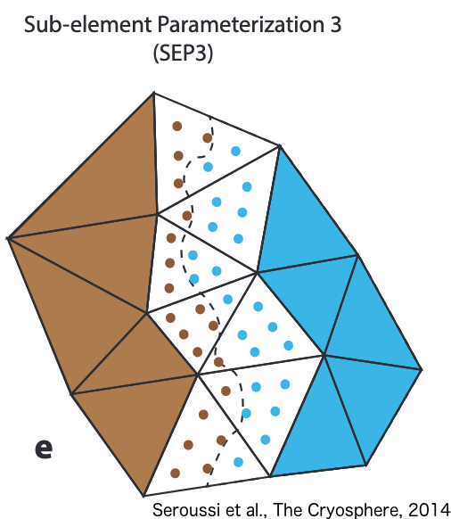
```
</div>
  - Requires the constants:
  ```text
  Constants
    sea level = Real $zsl
    water density = Real $rhow
  End
  ```
---

- **Material properties** are defined in the material section
  ```text
  Material 1
    ! Material properties
    Viscosity Exponent = Real $1/n
    Critical Shear Rate = Real 1.0e-16

    SSA Mean Viscosity = Equals Mu
    SSA Mean Density = Real $rhoi

    SSA Critical Thickness = Real $HMin

  ! slip coeff for the SSA
    SSA Friction Law = String "linear"
    SSA Friction Parameter = Equals slc0
  End
  ```
---
- **Body Forces**:
  - gravity
  ```text
  Body Force 1
    Flow BodyForce 1 = Real 0.0
    Flow BodyForce 2 = Real 0.0
    Flow BodyForce 3 = Real $gravity
  End
  ```

- **Boundary Conditions**:
  - Dirichlet conditions:
  ```text
  Boundary Condition 1
    Target Boundaries = 1

    Normal-Tangential SSAVelocity = Logical True
    SSAVelocity 1 = Real 0.0

  End
  ```
---

  - Neumann conditions:
   ```text
  Boundary Condition 2
    Target Boundaries = 2
    Calving Front = Logical True
  End
  ```

The natural condition for the SSA is the difference between force due the ice hysdrostatic pressure and the force exerted by the exterior, *i.e.* the hydrostatic water pressure below sea level and the atmosphere pressure (=0) above.

<div class="centered">
```{r, out.width = "30%", echo=FALSE}
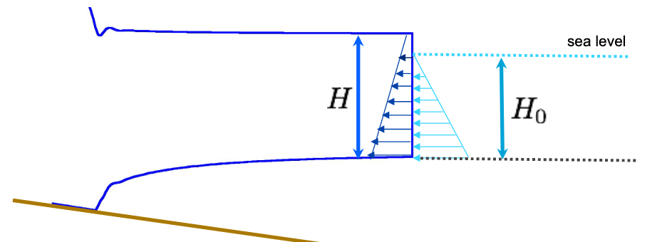
```
</div>

If nothing is prescribed the **natural Boundary condition** is no force difference which is equivalent of having a block of ice of the same thickness at the BC.

## Results | **tips**: learn how to use python scripts with paraview {.columns-2}

<div class="centered">
```{r, out.width = "80%", echo=FALSE}
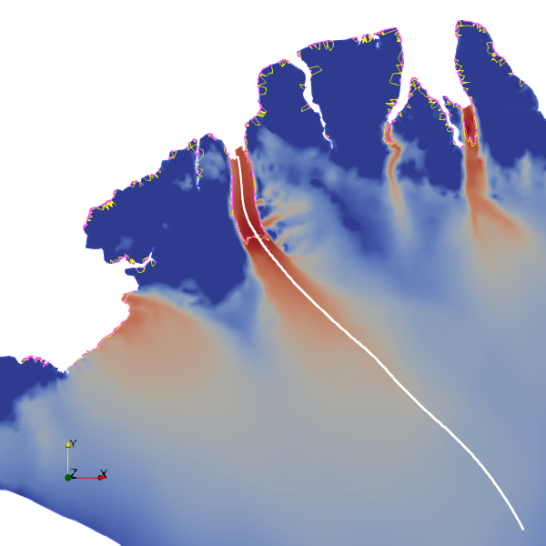
```
</div>

<div class="centered">
```{r, out.width = "80%", echo=FALSE}
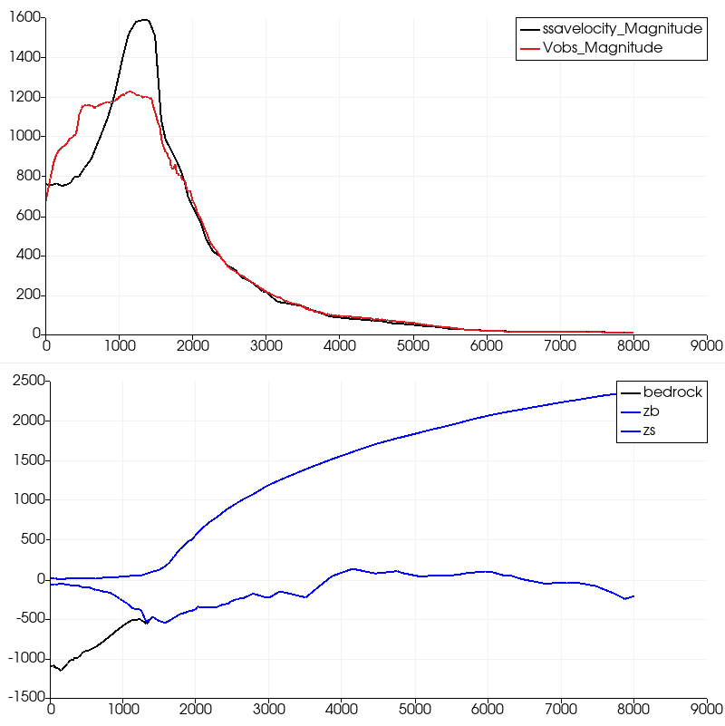
```
</div>


## Thickness Solver

- The thickness solver solves the continuity equation for the ice thickness:

  $$ \dfrac{\partial H}{\partial t} + \textrm{div} (\bar{u}H) = \dot{a}_s +  \dot{a}_b $$
  with :
    - $\bar{u}$ the vertically averaged horizontal velocity
    - $\dot{a}_s, \dot{a}_b$ the top and bottom surface accumulation assumed vertical
  
<br /> 

- See the Solver documentation [here](http://elmerfem.org/elmerice/wiki/doku.php?id=solvers:thicknesssolver)

## Thickness Solver implementation:

In **Elmer/4b_PROGNOSTIC** we run three 50y prognostic simulations

  - a control simulation with constant surface mass balance **CTRL.sif**
  
  - a perturbation experiment using a synthetic smb perturbation from InitMIP **dSMB.sif**
  
  - an experiment with basal melting under floating ice shelfs **BMB.sif**

---

```text
Solver 3
   Equation = "Thickness"
   Variable = -dofs 1 "H"
   Procedure = "ElmerIceSolvers" "ThicknessSolver"
   
   Exported Variable 1 = -dofs 1 "H Residual"
   Exported Variable 2 = DhDt
   Compute DhDt = Logical True

  ! Numerical settings;
   Linear System Solver = Direct
   Linear System Direct Method = umfpack
  ! required for limitation 
   Linear System Convergence Tolerance = 1.0e-12

   ! equation is linear if no min/max
    Nonlinear System Max Iterations = 10
    Nonlinear System Convergence Tolerance  = 1.0e-09
!!
    Stabilization Method = Stabilized  
    Transient Stabilisation = logical true
    Apply Dirichlet = Logical True

!!  the convection velocity (mean horizontal velocity)
    Flow Solution Name = String "SSAVelocity"
End
```

---

- **Stabilisation:**
  - The classical Galerkin method does not work to solve advection equations and a stabilisation method is required
  - The stabilisation method is chosen with the keyword **Stabilization Method**
    - **Stabilized** (default) is a Streamline Upwing Petrov-Galerkin method (SUPG)
      - **Transient Stabilisation = logical true** use a different formulation for the stabilisation parameter
    - **Bubbles** is a residual free bubbles method (this is the default for the *free surface solver*)
  - In general I set the bdf order to 2 for the timestepping
   ```text
    Simulation
    ...
      Timestepping Method = "bdf"
      BDF Order = 2
    ...
    End
    ```

---

- **Limiters:** 
  - enforce min/max limits for the ice thickness
  - make the system non-linear
  - Keywords related to limiters
  
```text
Solver X
 ...
 !% use limiters 
 Apply Dirichlet = Logical True
 
 !% the residual of the solution;i.e. volume to add to satisfy the limit
 Exported Variable 1 = -dofs 1 "H Residual"
 
 !% a toelrance criterion 
   Linear System Convergence Tolerance = 1.0e-12
End
```

```text
Material 1
 ...
 !% Min Value for H
   Min H = Real $HMin

End
```

--- 

- **Forcing:**
  - $\dot{a}_s, \dot{a}_b$ are prescribed in the body forces
  ```text
  Body Force 1
    Top Surface Accumulation = ...
     Bottom Surface Accumulation = ...
  End
  ```

- **Boundary conditions**
  - A Dirichlet boundary condition is required at inflow boundaries
  
## Transient simulations

The following solvers are solved in sequence during a time step

  1. **Flotation**: Update geometry and mask for current $H$ 
  
  2. **SSA**: compute the advection field
  
  3. **Thickness Solver**: compute new thickness
 
An iterative scheme can be used within time steps to couple the solvers; leading to a semi-implicit method, so this should improve the robustness of the solution
```text
Simulation
 ...
  Steady State Min Iterations = 1
  Steady State Max Iterations = 3
 ...
End
```

Convergence of the steady-state iterations is checked for each solver  with the keyword 

*Steady State convergence Tolerance = Real ...* 

---

- Tips:
  - Save a **pvd** file that contains informations about physical time: 
  ```text
    Simulation
      ...
      Post File = "$name$.vtu"
      vtu: Vtu Time Collection = Logical True
      ...
    End
  ```

## Remarks

- For the **dSMB** and **BMB** experiments the mass balance evolves with time. 

To visualise the total mass balance we create an intermediate variable using the **UpdateExport** Solver
```text
Solver 1
 Exec Solver = Before Timestep
 Equation = "Update"
 Procedure = "ElmerIceSolvers" "UpdateExport"
 Variable = -nooutput "up"

! This solver update exported variables from their definition in
! the body forces
 Exported Variable 1 = smba
End
```

```text
Body Force 1
! update the total smb (see solver 1)
  smba = Variable Time, smb, dsmb
   real procedure "SMB_A" "SMB_ANOM"
End
```  

---

- For the **BMB** experiment we have written a user function to prescribe a quadratic dependence to zb
```text
Body Force 1
  bmb = Variable GroundedMask,Zb
   real procedure "SUB_MELT" "SUB_MELT"
  SUB_MELT meltA = Real 0.0
  SUB_MELT meltB = Real -1.25e-4
End
```  

- The **bmb** variable is nodal and we prescribe melt only if the node is floting **(mask < 0)**. If we directly apply this for the **bottom accumulation** a partially floting element will have **some melt** resulting from the integration of the nodal variables. 

We can apply a no-melt parameterisation (see [Seroussi and Morlighem (2018)](https://tc.copernicus.org/articles/12/3085/2018/)) by checking if we are in a floating element or a partially floating element:
```text
Body Force 1
   Bottom Surface Accumulation = Variable bmb
    real procedure "SUB_MELT" "DISC_MELT"
End
```  
---

```text
 FUNCTION DISC_MELT
 ...
  CurEl => Model % CurrentElement
  NodeIndexes => CurEl % NodeIndexes(:)

  GM => VariableGet(Model%Mesh%Variables,"groundedmask",UnFoundFatal=.TRUE.)
  GMValues => GM % Values(:)
  GMPerm => GM % Perm(:)

  IF (ANY(GMValues(GMPerm(NodeIndexes(:))).GT.-0.5)) THEN
    VarOut=0._dp
  ELSE
    VarOut = VarIn
  END IF
END FUNCTION DISC_MELT
```   

## Results

- The solver **Scalar_OUTPUT.F90** in the **src** computes global variables (volume, fluxes, area): 

<div class="centered">
```{r, echo=FALSE, message=FALSE,warning=FALSE,results='hide', out.width="60%"}
ctrl <- read.table("../Elmer/4b_PROGNOSTIC/1DVar_OUTPUT_CTRL_.log", header = FALSE)
bmb <- read.table("../Elmer/4b_PROGNOSTIC/1DVar_OUTPUT_BMB_.log", header = FALSE)
dsmb <- read.table("../Elmer/4b_PROGNOSTIC/1DVar_OUTPUT_dSMB_.log", header = FALSE)
header <- c("Time","Volume", "Volume Above Floatation","Volume rate of change","SMB Flux","BMB Flux","Residual Flux","Ice Discharge","Ice flux at Grounding Line","Grounded ice area","Floating ice area","Ice Free area")
names(ctrl) <- header
names(bmb) <- header
names(dsmb) <- header

ggplot() + geom_line(data=ctrl,aes(x=Time,y=Volume*0.910/361.8e9,colour="ctrl")) +
 geom_line(data=bmb,aes(x=Time,y=Volume*0.910/361.8e9,colour="bmb")) + geom_line(data=dsmb,aes(x=Time,y=Volume*0.910/361.8e9,colour="dsmb")) +
  scale_color_manual(values = c('ctrl' = 'black','bmb'='blue','dsmb' = 'red')) +
 theme_bw() + ylab("volume (mm sle)") + xlab("Time (a)") + labs(color = 'exp.')

```
</div>

- The Elmer Solver **SaveScalars** can be used to perform other data reductions (min,max, mean, std, int etc...)

## Perspectives

Developpement perspectives for large scale simulations: 

- develop a 2D calving parametrisation for prognostic calving fronts

- thermo-mechanical coupling

- hybrid SIA/SSA solution

- ....

# inverse problems


## foreword

- A control inverse method is available for the Stokes and SSA solver.

- This is a variationnal method, i.e. the optimal set of parameters is found by minimising a cost function
that measures the mismatch between the model and some observations (usually surface velocities).

- These method are routinely used to tune the basal friction coefficient field, can also be used for the ice viscosity

- See details in the [Elmer/Ice 2017 workshop](http://elmerfem.org/elmerice/wiki/lib/exe/fetch.php?media=courses:2017:inverse.pdf)

---

- I have made some re-organisation of the codes in Spring 2020

- It is now fully documented in markdown documents [here](https://github.com/ElmerCSC/elmerfem/tree/elmerice/elmerice/Solvers/Documentation)
  - GitHub provides basic rendering of .md files 
  - You can use **pandoc** to convert the documentation to .pdf
  
- There is updated examples in the [elmer repository](https://github.com/ElmerCSC/elmerfem/tree/elmerice/elmerice/examples/Inverse_Methods)

## Assimilation procedure

1. Initialisation : here we take an ad-hoc value but better to start from you best guess

    ```text
        Initial Condition  1
        ! Initial guess of log10(slip coef.)
          alpha = Real -3.5
         End
    ```
    
2. Compute the velocity field (SSASolver)
3. Compute the cost function (Adjoint_CostDiscSolver)
4. Compute the adjoint state (Adjoint_LinearSolver)
5. Compute the derivative of the cost function with respect to the optimised parameter (AdjointSSA_GradientSolver)
6. Compute the regularisation term (Adjoint_CostRegSolver)
7. Update the friction coefficient (Optimize_m1qn3Parallel)

## Test case

The test case to initialise the basal friction coefficient is available under **/Elmer/5_OPTIMISATION**
 
- We run several inversions with increasing values of the regularisation parameter

- Optimal regularisation is found by plotting the L-Curve:

<div class="centered">
```{r, echo=FALSE, message=FALSE,warning=FALSE,results='hide', out.width="60%"}

lcurve <- read.table("../Elmer/5_OPTIMISATION/LCurve.log", skip = 1, header = FALSE)
names(lcurve) <- c("J0","Jreg","RMS","lambda","id")


ggplot() + geom_line(data=lcurve,aes(x=J0,y=Jreg)) + geom_point(data=lcurve,aes(x=J0,y=Jreg,colour=factor(lambda)),size = 3) +
  scale_x_continuous(trans = 'log10') +
  scale_y_continuous(trans = 'log10') +
theme_bw() + ylab(expression(J[reg])) + xlab(expression(J[0])) + labs(colour=expression(lambda[reg]))

```
</div>  
  
## Results

- Compare velocity error and friction coefficient for Run3 (top row) with the diagnostic example (bottom row): 

<div class="centered">
```{r, out.width = "60%", echo=FALSE}
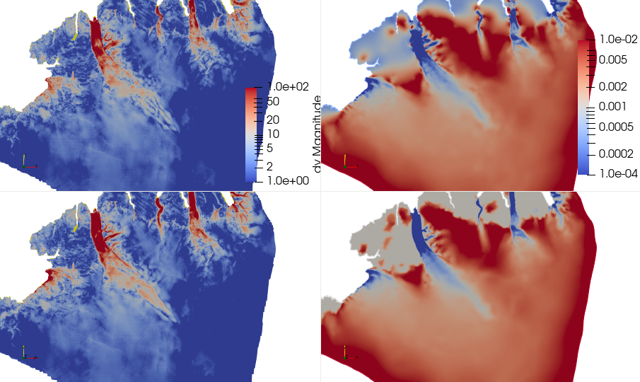
```
</div>  

## Perspectives

- Optimisation procedure is fairly robust and should not evolve too much, still need to version some solvers related to the mass conservation method for thickness inversions.

- challenges are related to:
  
  - regularisation; very simple for the moment (only assume smooth fields). How can we use optimisation results to  better define background statistics?
  
  - transient assimilation to assimilate observation series

  - How to initialise the friction in non glaciated areas?
  
  
 
